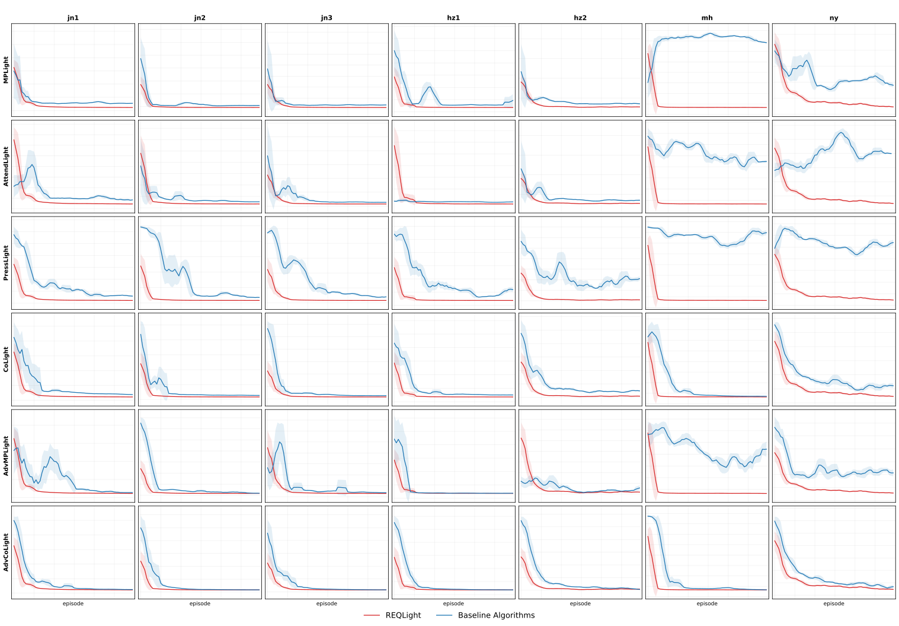
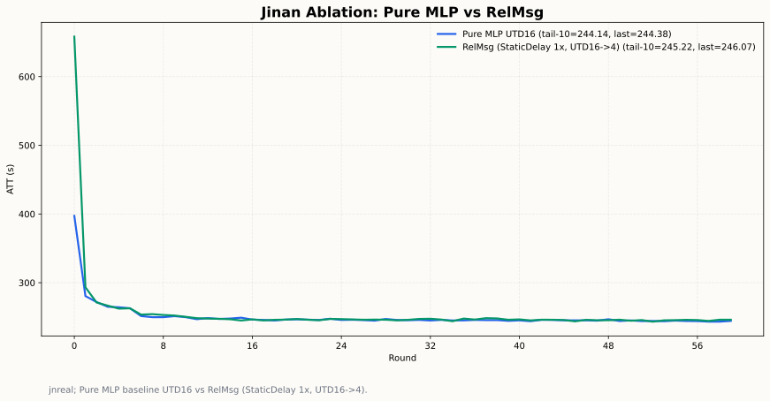
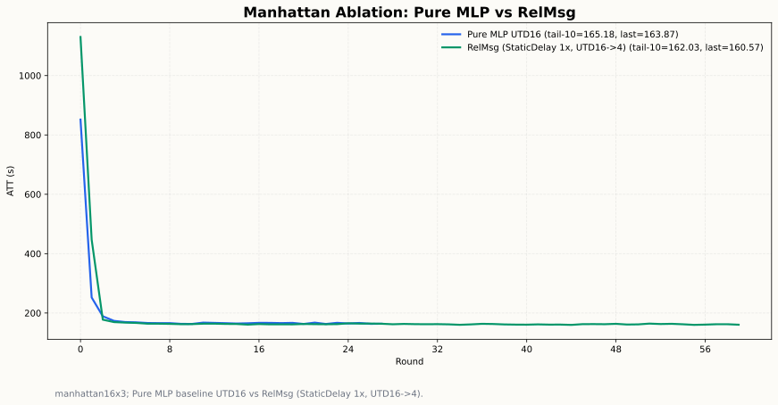
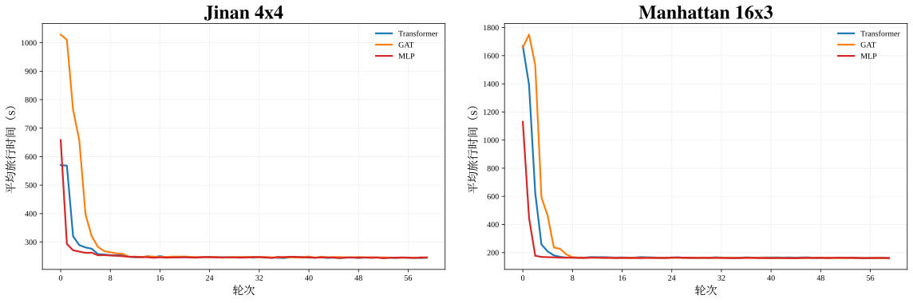
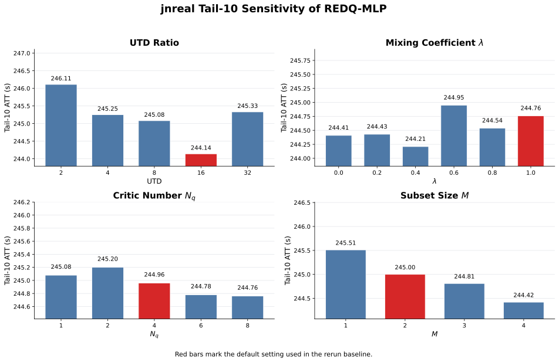
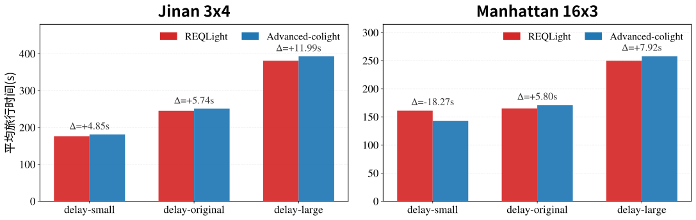
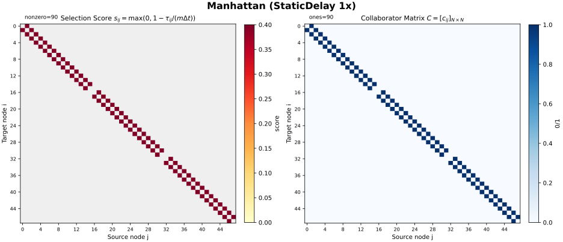
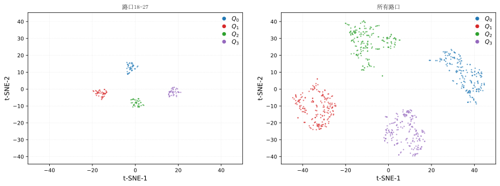

# Experimental Results

This page collects the representative results for the current method:

- REDQ-MLP
- Static collaborator candidate graph
- Relation-aware delay message mean aggregation (`relmsgmean`)

## 1. Main Results

Primary convergence comparison against conventional baselines:

Key ATT results from `main_att_with_sample_efficiency.csv`:

| Method | jn1 | jn2 | jn3 | hz1 | hz2 | ny | mh |
| --- | ---: | ---: | ---: | ---: | ---: | ---: | ---: |
| Ours | 245.22 | 233.13 | 229.24 | 271.59 | 305.96 | 162.03 | 898.22 |
| Adv-CoLight | 251.75 | 234.49 | 231.38 | 272.34 | 313.81 | 170.66 | 945.07 |
| CoLight | 269.28 | 252.68 | 248.54 | 298.28 | 339.91 | 179.99 | 1032.88 |
| MaxPressure | 274.99 | 246.41 | 244.63 | 289.55 | 349.85 | 775.63 | 1179.55 |
| FixedTime | 429.27 | 370.34 | 384.87 | 497.87 | 408.31 | 1070.45 | 1507.12 |

Sample-efficiency summary using the first round that reaches the `110%` best-ATT threshold:

- Ours: average `822.86` environment steps across 7 flows
- Adv-CoLight: average `6822.86` environment steps across 7 flows
- CoLight: average `11862.86` environment steps across 7 flows

Source table:
- `results/tables/main_att_with_sample_efficiency.csv`

## 2. Static Collaborator Ablation

Jinan `3x4`: pure local MLP vs static-collaborator `relmsgmean`

Manhattan `16x3`: pure local MLP vs static-collaborator `relmsgmean`

Observation:

- On the smaller Jinan road network, the gain over pure local MLP is limited.
- On the larger Manhattan road network, static collaborators bring a clearer improvement, which is consistent with stronger inter-intersection coupling and nontrivial propagation delay.

## 3. Encoder / Aggregator Comparison

Comparison against Transformer and GAT-style aggregation on Jinan and Manhattan:

Tail-10 ATT on Jinan:

| Method | Tail-10 ATT |
| --- | ---: |
| REDQ-Trans top5 | 245.01 |
| GAT Ablation (StaticDelay 1x) | 245.59 |
| RelMsg | 245.22 |

Tail-10 ATT on Manhattan:

| Method | Tail-10 ATT |
| --- | ---: |
| REDQ-Trans top5 | 162.56 |
| GAT Ablation (StaticDelay 1x) | 161.67 |
| RelMsg | 162.03 |

Source tables:
- `results/tables/arch_jnreal_metrics.csv`
- `results/tables/arch_manhattan_metrics.csv`

## 4. Sensitivity Analysis

Jinan tail-10 bar summary for `UTD`, `λ`, critic count `Nq`, and subset size `M`:

Best values observed in the scan:

- `UTD = 16`, tail-10 `244.14`
- `λ = 0.4`, tail-10 `244.21`
- `Nq = 8`, tail-10 `244.76`
- `M = 4`, tail-10 `244.42`

Source table:
- `results/tables/sensitivity_jnreal_tail10_4panel.csv`

## 5. Delay Validation

Delay-control validation on Jinan and Manhattan:

This figure shows that explicit delay-aware collaborator construction is meaningful under different delay settings, rather than acting as a generic neighbor concatenation trick.

## 6. Collaborator Visualization

Static collaborator matrix on Manhattan:

The selected collaborator pattern aligns with the delay-feasible connectivity structure instead of forming a dense all-to-all graph.

## 7. Q-Ensemble Representation Visualization

Joint t-SNE view of the pre-Q latent features for selected intersections and all intersections:

This visualization is used to inspect feature diversity across the REDQ critic ensemble under the current `relmsgmean` setting.

## 8. Files Included

Figures:

- `results/figures/main_7flow_vs_baselines.svg`
- `results/figures/ablation_jnreal_puremlp_vs_relmsg.svg`
- `results/figures/ablation_manhattan_puremlp_vs_relmsg.svg`
- `results/figures/arch_jnreal_manhattan_trans_gat_mlp.svg`
- `results/figures/sensitivity_jnreal_tail10_4panel.svg`
- `results/figures/validation_delay_compare_bar.svg`
- `results/figures/static_collaborator_heatmap_manhattan.svg`
- `results/figures/relmsg_qensemble_tsne.svg`

Tables:

- `results/tables/main_att_with_sample_efficiency.csv`
- `results/tables/arch_jnreal_metrics.csv`
- `results/tables/arch_manhattan_metrics.csv`
- `results/tables/sensitivity_jnreal_tail10_4panel.csv`
